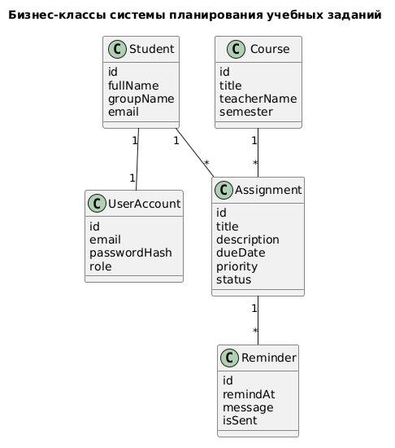

# Модель бизнес-классов

## Основные бизнес-сущности

| Сущность | Назначение | Ключевые атрибуты |
|---|---|---|
| Student | Представляет студента как основного пользователя системы | id, fullName, groupName, email |
| Course | Учебная дисциплина | id, title, teacherName, semester |
| Assignment | Учебное задание | id, title, description, dueDate, priority, status |
| Reminder | Напоминание о задании | id, remindAt, message, isSent |
| TaskStatus | Состояние выполнения задания | id, code, title |
| UserAccount | Учетная запись пользователя | id, email, passwordHash, role (`STUDENT`/`ADMIN`) |

## Бизнес-правила

- Задание обязательно связано хотя бы с одной дисциплиной.
- Задание должно иметь срок выполнения.
- Просроченным считается задание, срок которого меньше текущей даты, а статус не равен «выполнено».
- Напоминание не может быть установлено позже дедлайна задания.
- Один студент видит только собственные задания.
- Студент управляет собственным списком дисциплин.

## Диаграмма модели

