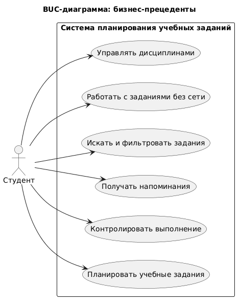

# BUC-диаграмма

## Бизнес-прецеденты

## Описание диаграммы

BUC-диаграмма отражает основные бизнес-прецеденты системы. Главный пользователь системы - студент, который планирует учебные задания, контролирует выполнение, создает напоминания, выполняет поиск, использует оффлайн-доступ и ведет собственный список дисциплин.
