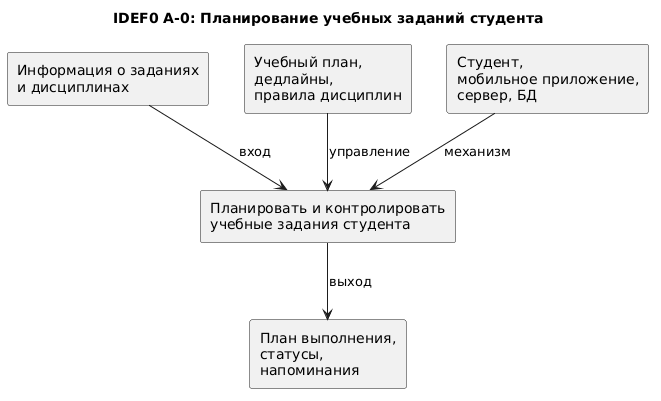

# IDEF0 A-0

## Диаграмма бизнес-контекста

## Описание диаграммы

Диаграмма показывает верхнеуровневый бизнес-процесс планирования и контроля учебных заданий студента. На вход процесса поступает информация о заданиях и дисциплинах, управление задается учебным планом, дедлайнами и правилами дисциплин, а механизмами выполнения выступают студент, мобильное приложение, серверная часть и база данных.
