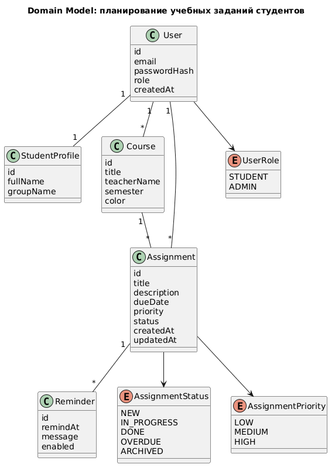

# Domain Model

## Назначение

Domain Model описывает основные понятия предметной области без привязки к конкретной реализации базы данных или программных классов. Модель используется как основа для проектирования Entity-слоя, REST API и мобильного кэша.

## Диаграмма

## Описание сущностей

| Сущность | Описание | Основные связи |
|---|---|---|
| User | Учетная запись пользователя системы | Имеет профиль, задания и дисциплины |
| StudentProfile | Профиль студента | Принадлежит одному пользователю |
| Course | Учебная дисциплина | Принадлежит пользователю, объединяет задания |
| Assignment | Учебное задание | Связано с пользователем, дисциплиной и напоминаниями |
| Reminder | Напоминание о дедлайне | Принадлежит одному заданию |

## Бизнес-правила

- Email пользователя должен быть уникальным.
- Пароль пользователя хранится только в виде хеша.
- Студент может просматривать и изменять только собственные задания.
- Каждое задание должно иметь название, срок выполнения, статус и приоритет.
- Дедлайн задания не может быть пустым.
- Напоминание не может быть назначено позже дедлайна задания.
- Задание считается просроченным, если срок выполнения прошел, а статус не равен `DONE`.
- Удаление дисциплины возможно только после переноса или удаления связанных заданий.
- Локальный кэш мобильного приложения хранит временную копию данных; при наличии сети приложение синхронизирует ее с сервером.
- Системные данные студента изолированы от данных других пользователей.
