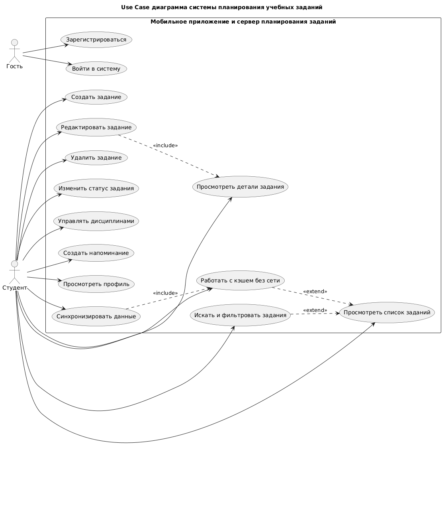

# Use Case диаграмма

## Системные акторы

| Актор | Описание |
|---|---|
| Гость | Пользователь, который еще не прошел аутентификацию |
| Студент | Основной пользователь мобильного приложения |

## Диаграмма

## Краткое описание прецедентов

| Код | Прецедент | Назначение |
|---|---|---|
| UC-01 | Зарегистрироваться | Создание учетной записи студента |
| UC-02 | Войти в систему | Получение JWT-токена для доступа к API |
| UC-03 | Просмотреть список заданий | Получение актуального списка учебных заданий |
| UC-04 | Просмотреть детали задания | Просмотр описания, дедлайна, дисциплины, приоритета и статуса |
| UC-05 | Создать задание | Добавление нового учебного задания |
| UC-06 | Редактировать задание | Изменение параметров задания |
| UC-07 | Удалить задание | Удаление неактуального задания |
| UC-08 | Изменить статус задания | Перевод задания между состояниями |
| UC-09 | Искать и фильтровать задания | Отбор заданий по дисциплине, статусу, сроку и приоритету |
| UC-10 | Управлять дисциплинами | Создание и редактирование дисциплин |
| UC-11 | Создать напоминание | Настройка записи с датой, временем и текстом напоминания |
| UC-12 | Просмотреть профиль | Просмотр и изменение данных студента |
| UC-13 | Работать с кэшем без сети | Просмотр сохраненных данных при отсутствии интернета |
| UC-14 | Синхронизировать данные | Обновление локального кэша и серверных данных |
