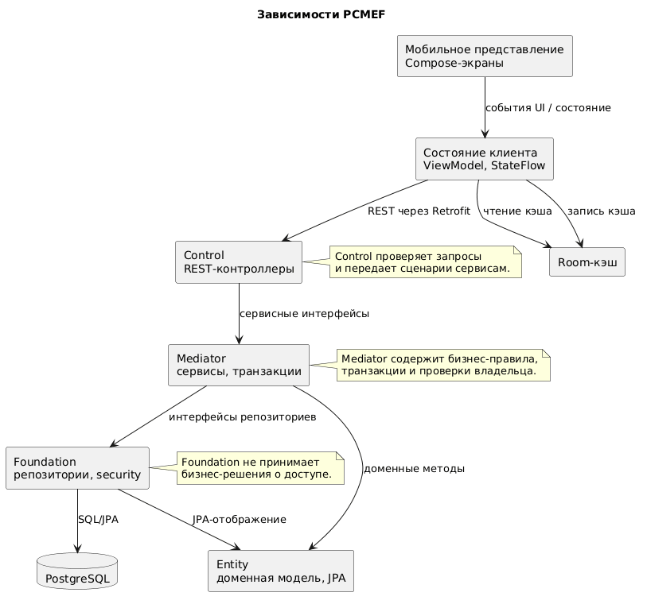

# Диаграмма зависимостей

## Направление зависимостей

## Запрещенные зависимости

| Запрещенная зависимость | Причина |
|---|---|
| Entity -> Control | Сущности не должны знать о HTTP, DTO и контроллерах |
| Entity -> Foundation | Сущности не должны выполнять запросы к БД |
| Foundation -> Mediator | Репозитории не должны вызывать бизнес-сервисы |
| Control -> Foundation | Контроллеры не должны обращаться к БД напрямую |
| Mediator -> Presentation | Серверная бизнес-логика не должна зависеть от мобильного UI |
| Локальный кэш клиента -> Backend Entity | Клиентский кэш не должен использовать серверные JPA-сущности |

## Проверка отсутствия циклов

На этапе реализации отсутствие циклических зависимостей будет контролироваться следующими правилами:

- пакеты `control` могут зависеть от `mediator`, DTO и простых доменных типов `entity`, но не импортируют `foundation`;
- пакеты `mediator` могут зависеть от `entity`, `foundation` и DTO-мапперов;
- пакеты `entity` не зависят от `control` и `mediator`;
- пакеты `foundation` не зависят от `control`; security principal `CurrentUser` вынесен в `entity`, чтобы избежать прямой зависимости `control -> foundation`;
- мобильный клиент взаимодействует с сервером только через REST API.

## Риски нарушения архитектуры

| Риск | Последствие | Профилактика |
|---|---|---|
| Бизнес-логика в контроллерах | Сложность тестирования и дублирование правил | Все сценарии реализуются в сервисах |
| SQL-запросы в сервисах | Размывание Foundation-слоя | Доступ к данным только через репозитории |
| Прямое использование серверных DTO в Room | Сложная синхронизация и хрупкий клиент | Отдельные локальные модели и мапперы |
