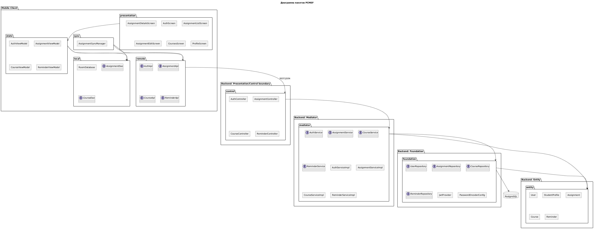

# Диаграмма пакетов

## PCMEF-структура системы

## Пояснение

Мобильное приложение реализует пользовательское представление и техническую поддержку оффлайн-режима. Серверная часть реализует основные слои PCMEF: Control принимает REST-запросы, Mediator содержит бизнес-логику, Entity описывает состояние предметной области, Foundation отвечает за доступ к данным и инфраструктурные компоненты.
