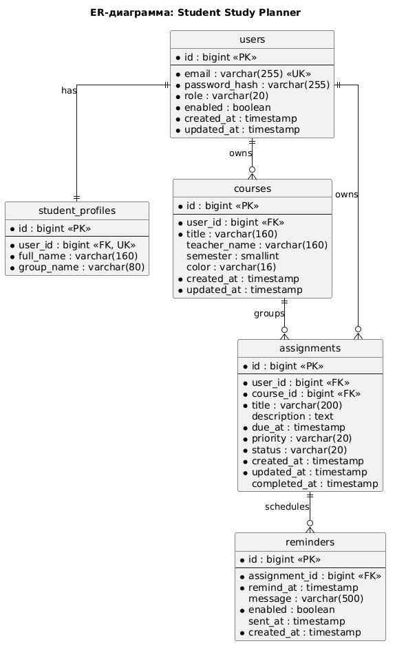

# ER-диаграмма

## Назначение

ER-модель описывает логическую структуру данных серверной части. Она основана на Domain Model этапа 1 и уточняет связи, кратности и владение данными для реализации в PostgreSQL и JPA.

## Диаграмма

## Связи

| Связь | Кратность | Обоснование |
|---|---|---|
| `users` - `student_profiles` | 1:1 | У каждой учетной записи студента есть один профиль |
| `users` - `courses` | 1:N | Студент ведет собственный список дисциплин |
| `users` - `assignments` | 1:N | Студент видит и изменяет только собственные задания |
| `courses` - `assignments` | 1:N | Каждое задание относится к одной дисциплине |
| `assignments` - `reminders` | 1:N | Для задания можно настроить несколько напоминаний |

## Нормализация

Модель соответствует третьей нормальной форме:

- каждая таблица описывает одну сущность предметной области;
- все неключевые атрибуты зависят от первичного ключа своей таблицы;
- транзитивные зависимости вынесены в отдельные таблицы, например профиль пользователя и дисциплины не хранятся внутри задания;
- повторяющиеся наборы данных, такие как напоминания, вынесены в отдельные таблицы.
