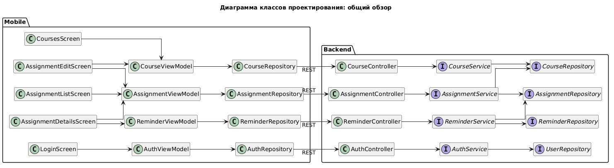
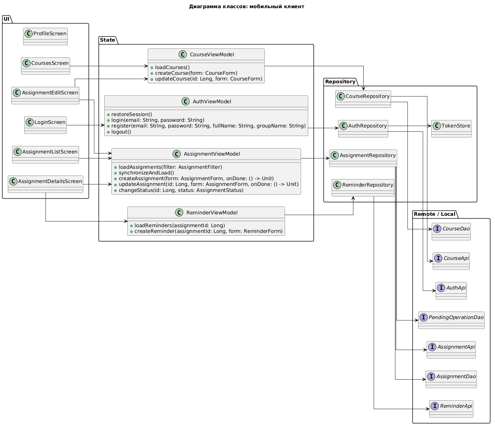
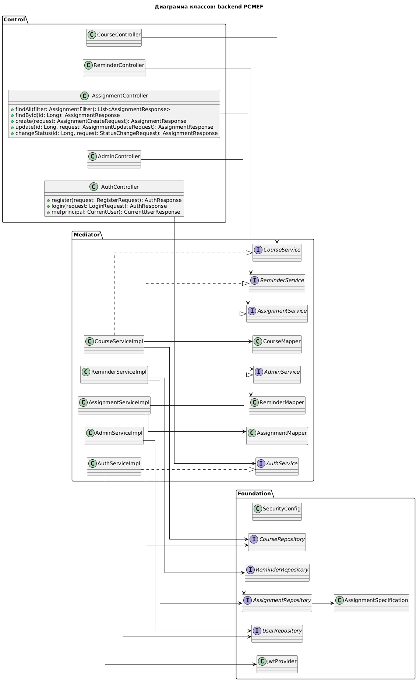
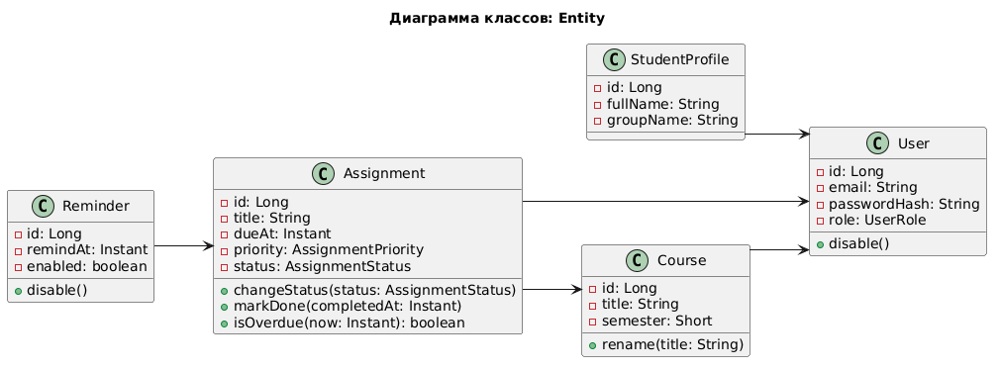

# Диаграмма классов проектирования

## Назначение

Диаграмма классов проектирования уточняет структуру реализации. Чтобы схема оставалась читаемой, она разделена на несколько фрагментов: общий обзор, мобильный клиент, backend-слои и доменную модель.

## Общая структура

## Мобильный клиент

## Backend-слои

## Доменная модель

## Пояснение

Обзорная диаграмма показывает основные зависимости между экранами, ViewModel, repository и backend. Отдельные фрагменты раскрывают детали мобильного клиента, серверных слоев PCMEF и Entity-модели.