# Исходники диаграмм

В этом файле собраны исходные PlantUML-коды диаграмм. В основных документах отображаются готовые изображения из `docs/images`.

## 00-initiation/business-classes.md

### Модель бизнес-классов

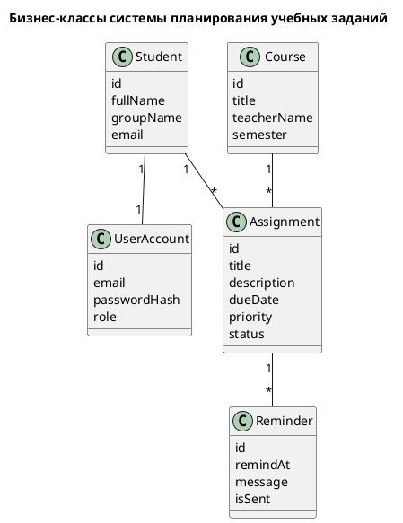

## 00-initiation/business-use-cases.md

### BUC-диаграмма

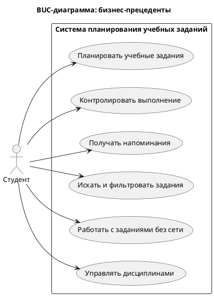

## 00-initiation/idef0-a0.md

### IDEF0 A-0

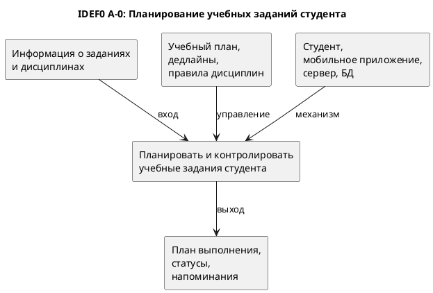

## 01-requirements/domain-model.md

### Domain Model

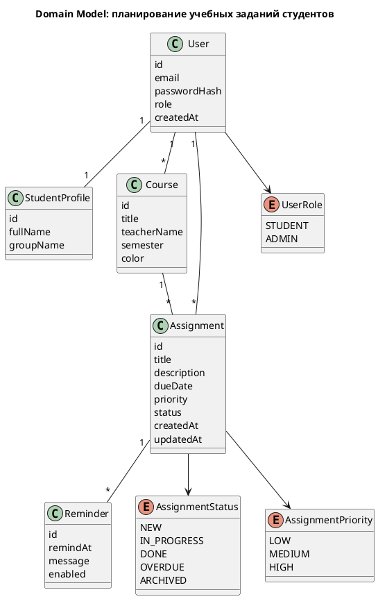

## 01-requirements/use-case-diagram.md

### Use Case диаграмма

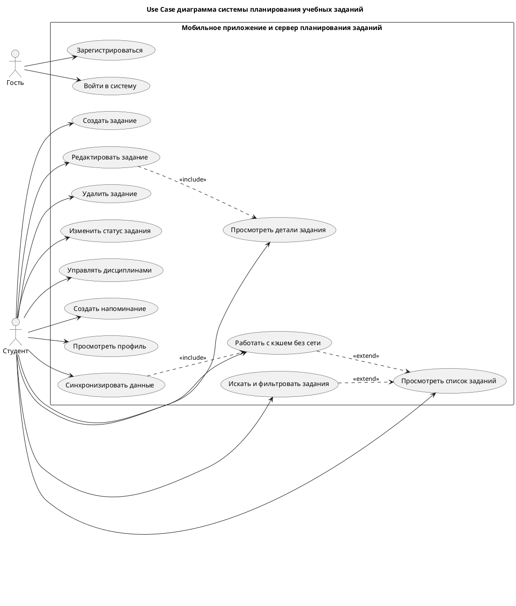

## 02-architecture/package-diagram.md

### Диаграмма пакетов

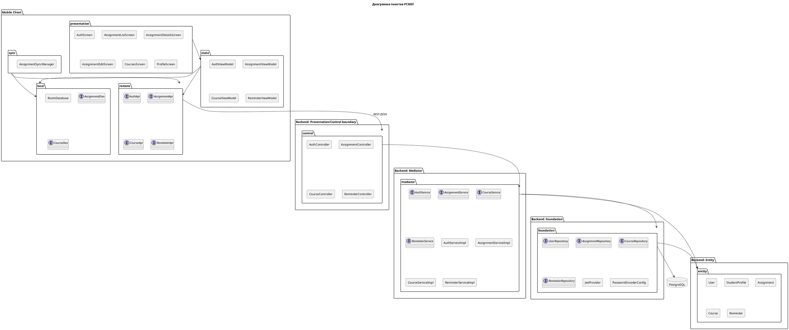

## 02-architecture/dependency-diagram.md

### Диаграмма зависимостей

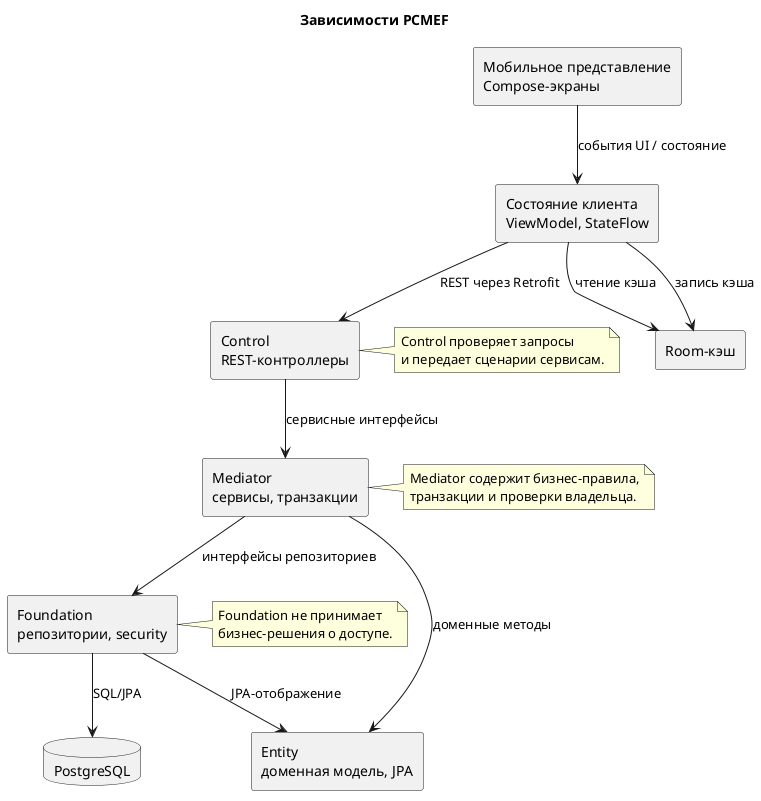

## 03-database/er-diagram.md

### ER-диаграмма

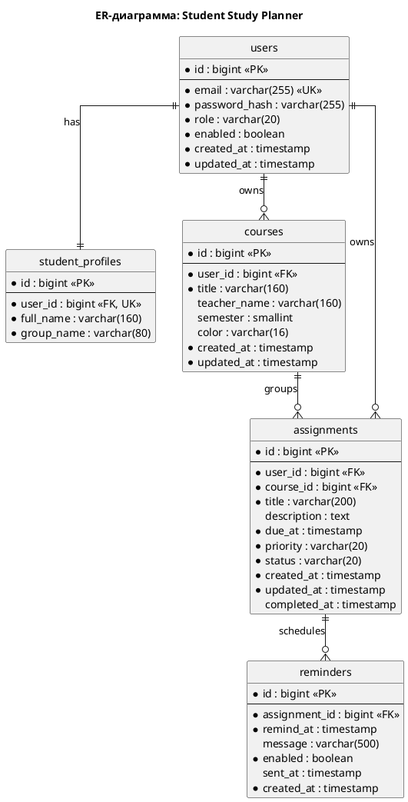

## 04-detailed-design/sequence-diagrams.md

### SD-01. Вход пользователя

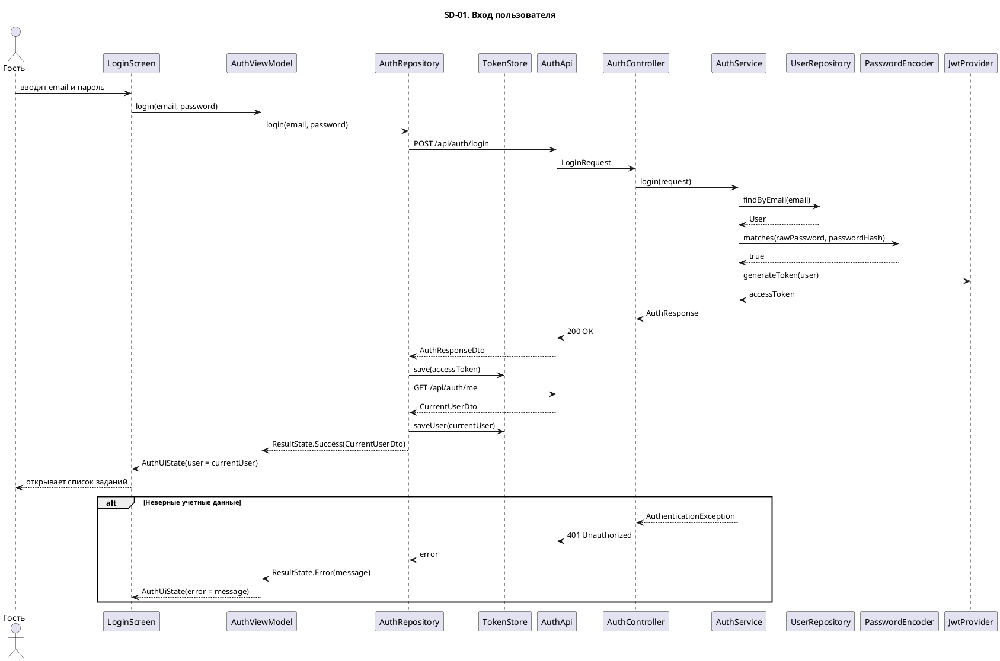

### SD-02. Создание учебного задания

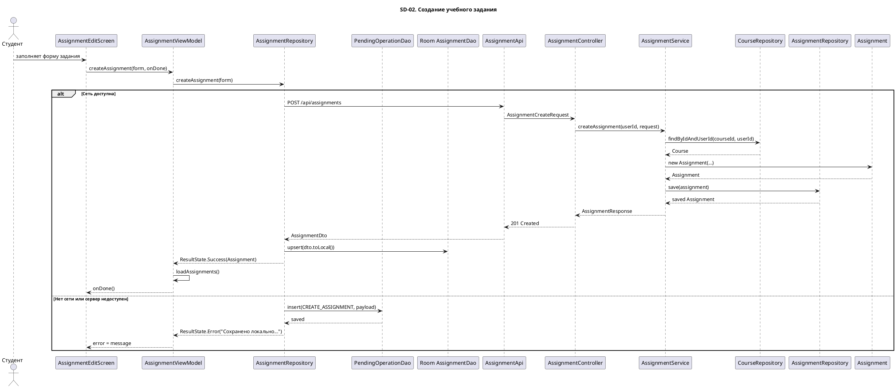

### SD-03. Поиск и фильтрация заданий

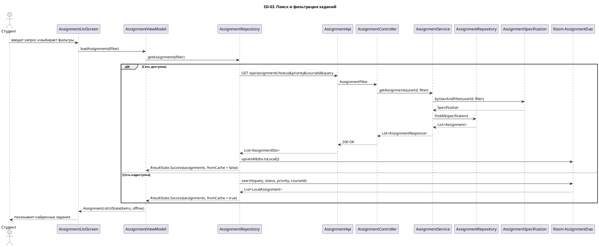

### SD-04. Оффлайн-синхронизация

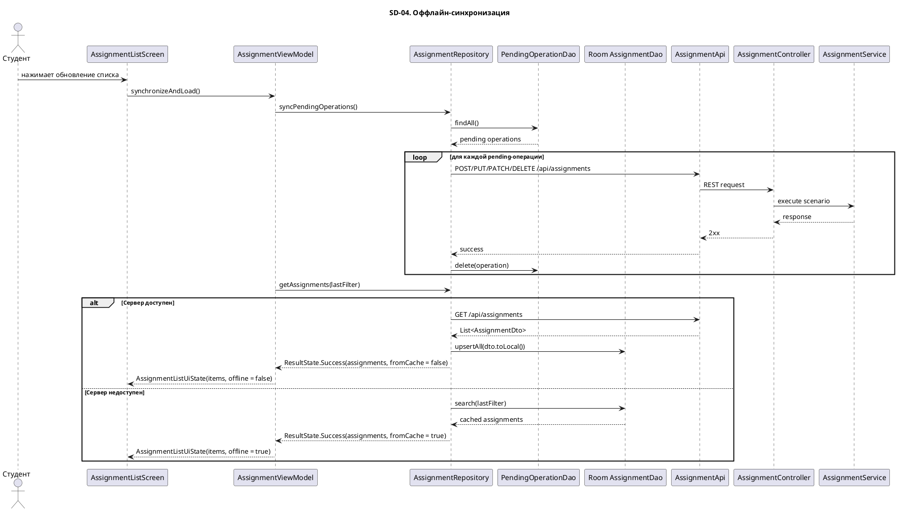

## 04-detailed-design/design-class-diagram.md

### Диаграмма классов: общий обзор

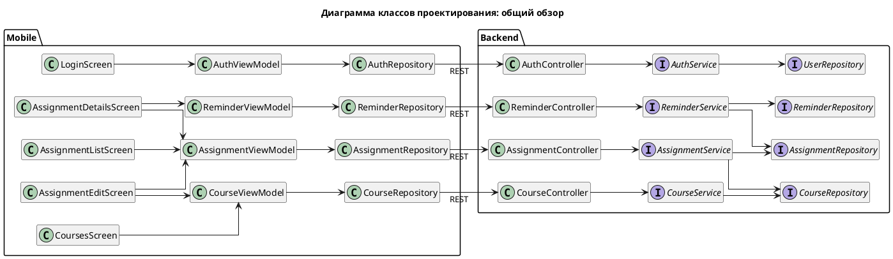

### Диаграмма классов: мобильный клиент

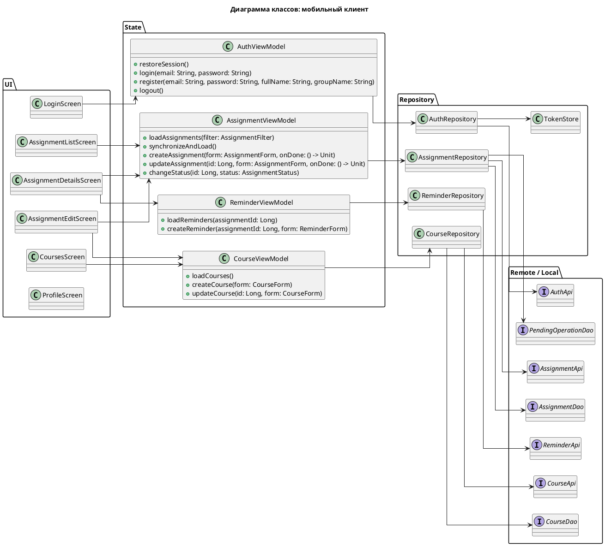

### Диаграмма классов: backend PCMEF

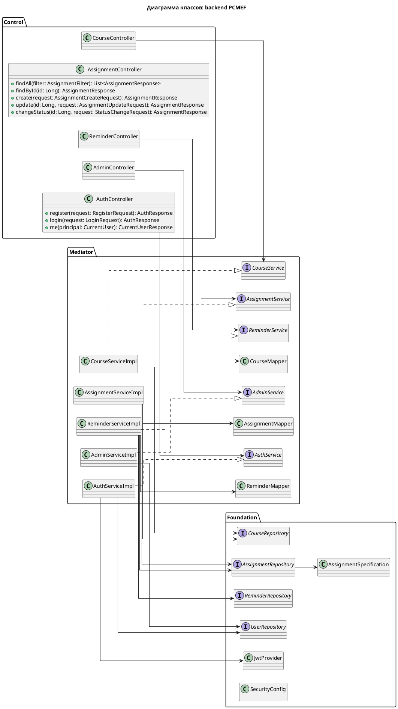

### Диаграмма классов: Entity

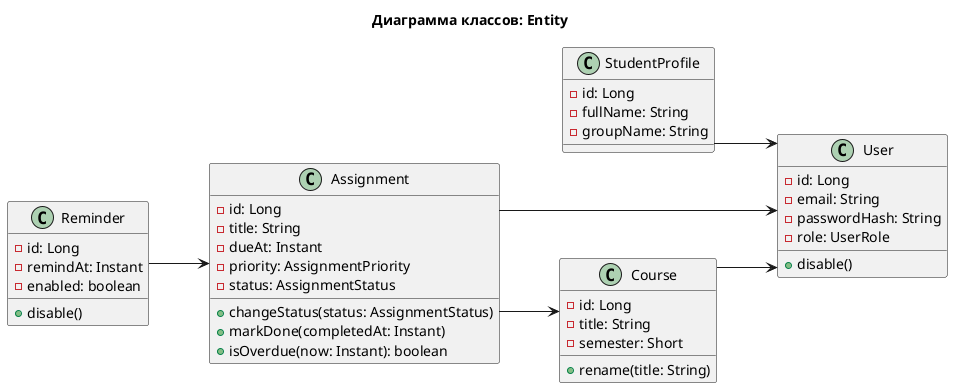

## 08-finalization/gantt.md

### Диаграмма Ганта

```plantuml
@startgantt
title План выполнения курсового проекта
Project starts 2026-02-03

[Этап 0. Инициация и бизнес-анализ] lasts 14 days
[Этап 0. Инициация и бизнес-анализ] is 100% completed

[Этап 1. Определение требований] starts at [Этап 0. Инициация и бизнес-анализ]'s end
[Этап 1. Определение требований] lasts 14 days
[Этап 1. Определение требований] is 100% completed

[Этап 2. Архитектура PCMEF] starts at [Этап 1. Определение требований]'s end
[Этап 2. Архитектура PCMEF] lasts 14 days
[Этап 2. Архитектура PCMEF] is 100% completed

[Этап 3. Проектирование БД] starts at [Этап 2. Архитектура PCMEF]'s end
[Этап 3. Проектирование БД] lasts 14 days
[Этап 3. Проектирование БД] is 100% completed

[Этап 4. Детальное проектирование] starts at [Этап 3. Проектирование БД]'s end
[Этап 4. Детальное проектирование] lasts 14 days
[Этап 4. Детальное проектирование] is 100% completed

[Этап 5. Реализация ядра] starts at [Этап 4. Детальное проектирование]'s end
[Этап 5. Реализация ядра] lasts 14 days
[Этап 5. Реализация ядра] is 100% completed

[Этап 6. Рефакторинг и качество] starts at [Этап 5. Реализация ядра]'s end
[Этап 6. Рефакторинг и качество] lasts 14 days
[Этап 6. Рефакторинг и качество] is 100% completed

[Этап 7. Мобильный интерфейс] starts at [Этап 6. Рефакторинг и качество]'s end
[Этап 7. Мобильный интерфейс] lasts 14 days
[Этап 7. Мобильный интерфейс] is 100% completed

[Этап 8. Завершение и защита] starts at [Этап 7. Мобильный интерфейс]'s end
[Этап 8. Завершение и защита] lasts 14 days
[Этап 8. Завершение и защита] is 100% completed
@endgantt
```
